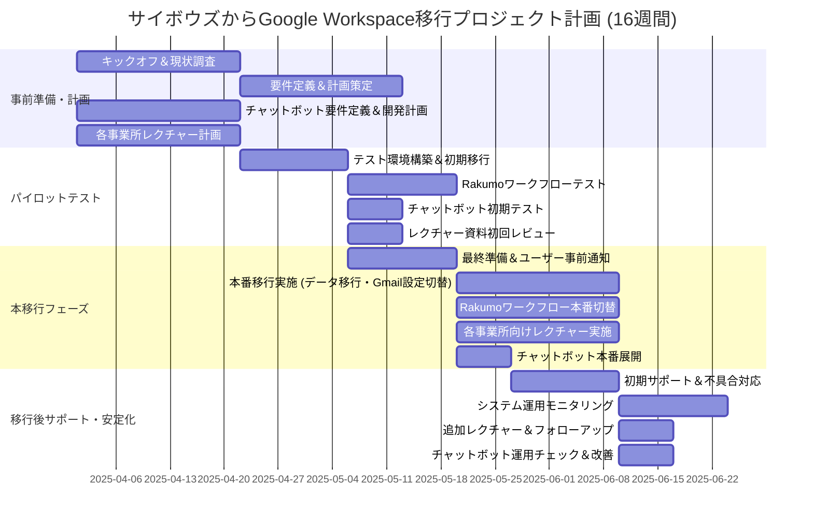

# プロジェクト計画書
## プロジェクト名
サイボウズからGoogle Workspace移行プロジェクト

## プロジェクト概要
本プロジェクトは、当社が現行で利用しているサイボウズグループウェアから、Google Workspaceへ移行するものです。  
移行後は、グループウェアとしてGoogle Workspaceの各機能（Google カレンダー、Google Chat、Gmail、Google ドライブ、Google ドキュメント、Google スプレッドシート、Google スライド）を基本とし、社内文書管理を効率化します。  
また、承認ワークフローはRakumoの機能を活用し、申請、承認、回覧、代理承認などの業務プロセスをデジタル化します。  
さらに、各事業所に対してレクチャーを実施し、ユーザーへの操作指導と新運用ルールの周知、加えてGoogle Workspace問い合わせ用チャットボットの導入により、ユーザーサポート体制の強化を図ります。  
なお、既存のsawarise.co.jpドメインで運用していたメールサービスは、2026年4月1日をもって停止し、以降はsawarise.comドメインのGmailでの運用に完全移行します。

## 目的
- **業務効率化:**  
  社内文書の共同編集・バージョン管理、リアルタイムの情報共有、移動性の向上により業務プロセスの効率化を実現する。
- **システム統一:**  
  全社員が統一したGoogle Workspace環境で作業することで、情報共有とコミュニケーションの円滑化を促進する。
- **承認プロセスの最適化:**  
  Rakumoの承認ワークフローにより、申請・承認作業の自動化と迅速化を実現する。
- **ユーザーサポート強化:**  
  各事業所向けレクチャーや問い合わせチャットボットの導入により、ユーザーの疑問解消とサポート体制を強化する。
- **メールサービス統合:**  
  sawarise.co.jpで運用していたメールサービスを2026年4月1日付で停止し、以降はsawarise.comドメインのGmailで統一運用する。

## プロジェクト範囲
- **対象システム:**  
  - サイボウズグループウェアのスケジュール、連絡、チャット、メール機能の移行
  - Google Workspace（グループウェア全般および社内文書管理機能）の導入
  - Rakumo承認ワークフローの導入・運用開始
  - 問い合わせ用チャットボットの開発・導入
  - 各事業所向けレクチャーおよびトレーニングの実施
- **対象ユーザー:**  
  約200人規模、複数事業所に跨る全社員

## プロジェクト体制
- **プロジェクトマネージャー:** [氏名]
- **技術担当:** Google Workspace移行担当、Rakumo連携担当、チャットボット開発担当
- **事業所代表者:** 各事業所のシステム管理者および運用担当
- **サポートチーム:** 移行後サポート担当（専任サポートチーム）

## スケジュール（全体16週間）
以下は、各フェーズの詳細スケジュールの概要です。

### 1. 事前準備・計画フェーズ (Week 1～Week 3)
- **キックオフ＆現状調査 (21日):**  
  プロジェクト開始日2025-04-01にキックオフミーティングを実施し、関係部署・担当者を決定。  
  サイボウズ上の各種利用状況および既存承認フローを詳細に調査する。
- **要件定義＆計画策定 (21日):**  
  Google Workspace各サービスの利用ルール・運用方法を定義。  
  Rakumo承認ワークフローの運用ルール、テンプレート、ユーザー権限を整理し、社内文書管理はGoogle Workspaceで運用する計画を策定。
- **チャットボット要件定義＆開発計画 (21日):**  
  問い合わせ用チャットボットの対応内容、連携先、運用方法の要件を定義。  
  開発計画およびテスト環境構築計画を策定する。
- **各事業所レクチャー計画 (21日):**  
  レクチャーのスケジュール、参加者リスト、教材、講師の選定を実施する。

### 2. パイロットテストフェーズ (Week 4～Week 7)
- **テスト環境構築＆初期移行 (14日):**  
  限定ユーザーを対象に、Google Workspace環境へのテスト移行を実施。  
  データ移行、Gmail設定、社内文書管理の整合性を確認する。
- **Rakumoワークフローのテスト (14日):**  
  テスト用承認ルート、テンプレートを設定し、Rakumoの承認ワークフローが正しく動作するか検証する。
- **チャットボット初期テスト (7日):**  
  初期バージョンのチャットボットをテスト環境に展開し、動作確認とフィードバックを収集する。
- **レクチャー資料初回レビュー (7日):**  
  各事業所向けレクチャー資料および運用方法をレビューし、改善点を洗い出す。

### 3. 本移行フェーズ (Week 8～Week 12)
- **最終準備＆ユーザー事前通知 (14日):**  
  本番移行日の確定後、全ユーザー・各事業所へ移行スケジュール、手順、影響範囲、問い合わせチャットボット利用方法などを通知。  
  Rakumo承認ワークフローおよびレクチャー資料の最終調整、バックアップ・ロールバックプランの再確認を実施。
- **本番移行実施 (21日):**  
  業務時間外または低負荷時間帯に、Google Workspaceへの最終データ移行とGmail設定切替を実施。  
  ※sawarise.comドメインのGmail運用開始、sawarise.co.jp宛ルーティング調整を行い、2026年4月1日以降、sawarise.co.jpメールは停止となる。
  Rakumo承認ワークフローの本番環境切り替えと最終テスト、各事業所向けレクチャーの現地またはオンライン実施。
- **チャットボット本番展開 (7日):**  
  テストフィードバックを反映したチャットボットを本番環境に展開し、最終動作確認を実施する。

### 4. 移行後サポート・安定化フェーズ (Week 13～Week 16)
- **初期サポート＆不具合対応 (14日):**  
  移行後1～2週間、専任サポートチームが各システムの運用状況をモニタリングし、迅速に不具合対応を実施する。
- **システム運用モニタリング (14日):**  
  社内文書管理、共同編集、チャットボット利用状況を定期的にチェックし、必要な改善策を実施する。
- **追加レクチャー＆フォローアップ (7日):**  
  各事業所への追加レクチャーやフォローアップ講習を実施し、ユーザーの疑問解消に努める。
- **チャットボット運用チェック＆改善 (7日):**  
  本番展開後のチャットボットの運用状況を確認し、FAQ更新や機能改善を実施する。

---

# Mermaid ガントチャート（16週間版）

