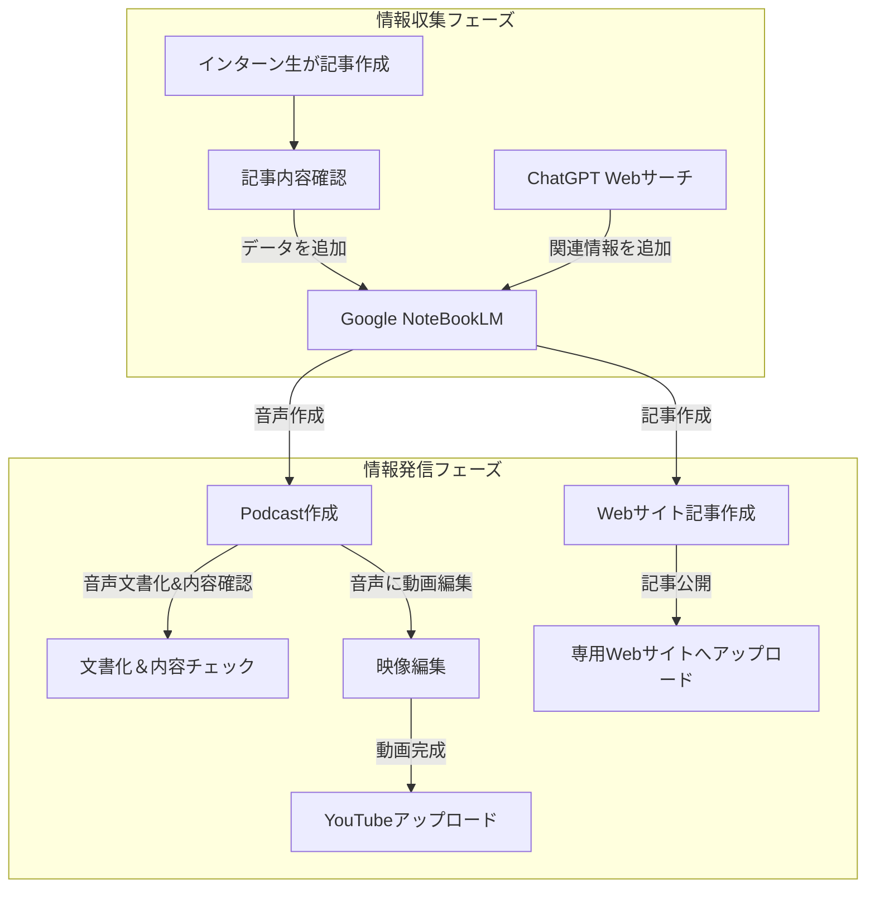
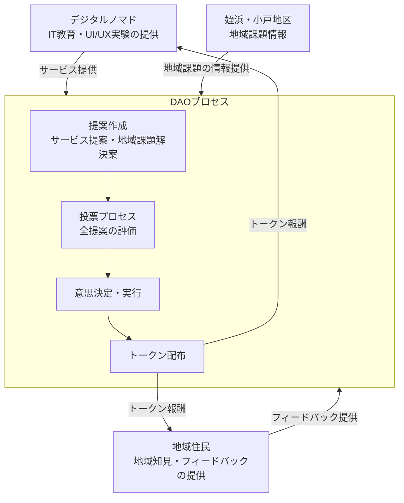

# **福岡市 小戸・姪浜グローバル共創プラットフォーム企画書**

## 背景
###  福岡における公式観光・滞在情報発信サイトの現状

福岡市や福岡県では、観光や滞在に関する情報発信のための公式サイトが非常に限られています。大都市では複数の公式・民間サイトが存在する中、福岡の場合、以下のような主要な窓口が中心となっています。

- **福岡市観光情報サイト「よかなび」**  
  - URL: [https://yokanavi.com/](https://yokanavi.com/)  
  - ※「よかなび」は2008年に開設され、2016年にリニューアルされたサイトです。福岡市の観光・イベント情報やグルメ情報を発信していますが、公式の情報発信基盤としてはこの一つに集約されており、他の大都市と比較すると選択肢が非常に限られている状況です。

- **福岡県公式観光情報サイト「クロスロードふくおか」**  
  - URL: [https://www.crossroadfukuoka.jp/](https://www.crossroadfukuoka.jp/)  
  - ※「クロスロードふくおか」は、福岡県が運用する公式観光・旅行情報サイトです。福岡の主要な観光スポットや体験、イベント情報などがまとめられていますが、こちらも地域全体で独自のサイトが多数存在するわけではなく、情報発信の拠点はごく限られています。

- **西区情報サイト「Gokant Go!」**  
  - URL: [https://gokant-go.sawarise.co.jp/](https://gokant-go.sawarise.co.jp/)  
  - ※「Gokant Go!」は、株式会社サワライズが運用している福岡市西区の情報サイトです。福岡市西区の観光スポット、グルメ、イベント情報が纏められていますが、外国語向けの情報が少ないのげ現状です。

これらの公式サイトが福岡における観光・滞在情報の主な発信源となっている一方で、公式サイト自体の数が少ないため、福岡の魅力をより広範かつ多角的に伝えるための新たな情報発信手段やプラットフォームの充実が求められていると言えます。

## 目的

本システムは、単なる情報の発信に留まらず、世界中の人々が心を動かされ、地域コミュニティが新たな価値と活力を獲得し、**新しい形で多様な人たちが互いに助け合える関係を築けるプラットフォーム**の実現を目指します。

### 多様な人たちに小戸・姪浜にお越しいただくためのプラットフォーム

- 多言語かつ多媒体のアプローチを通じ、各国から訪れる観光客やデジタルノマドの心に響くストーリーや体験を提供し、発見と共感を創出します。

- 地域の歴史や文化、現地ならではの魅力を深堀りすることで、情報発信を一つの価値創造の手段とし、街全体に新たな経済的・文化的豊かさをもたらします。

- 現在の情報技術やメディア表現を革新し、次世代への希望や夢を育む未来志向の発信基盤を構築。これにより、未来の都市像と生活スタイルの在り方に新たなインスピレーションを提供します。

### 多様な人たちが小戸・姪浜で活躍するためのプラットフォーム

- **多彩な才能の発掘と交流:**  
  国内外から集まるクリエイター、起業家、研究者、アーティスト、技術者など、あらゆる分野の才能が一堂に会する場を提供します。オンラインとオフラインの双方で、ワークショップ、セミナー、ネットワーキングイベントを通じた情報交換とアイデアの融合を促進し、新たなプロジェクトやコラボレーションの可能性を広げます。

- **地域資源とグローバルノウハウの融合:**  
  小戸・姪浜の歴史、文化、自然環境といった地域固有の魅力を、国内外の先進的な技術や知見と連携させることで、地域発のイノベーションを創出します。地元企業や自治体との連携を強化し、実践的なフィールドプロジェクトを推進することで、地域経済の活性化にも寄与します。

- **学びと成長の支援体制:**  
  新たな技術や知識の習得を支援するため、教育プログラムと交流拠点を充実させます。これにより、参加者一人ひとりが自らのスキルを磨き、キャリアアップや新規事業創出に結びつけられる環境を整えます。

- **共創による持続可能なコミュニティの構築:**  
  多様なバックグラウンドを持つ個人や団体が、共通の目標に向かって連携し合うことで、地域社会全体の発展と共生を実現します。オープンな情報共有プラットフォームとコミュニティ支援システムを活用し、参加者同士が互いに学び、助け合う仕組みを確立することで、未来志向の持続可能なエコシステムを築きます。

このビジョンの下、情報収集からコンテンツ制作、発信までを一体化するシステムは、国境や世代を超えた「感動の連鎖」を生み出し、人々と街、そして未来が一体となる持続可能な価値の創造を実現していくことを目指します。

## 提供するサービス

- **海外からの観光客（インバウンド）の誘致**  
  - 西区の豊かな文化、歴史、観光スポット、グルメ、イベントなど、地域の魅力を英語や中国語で発信することにより、海外からの観光客に対して地域の認知度を高める。
  
- **デジタルノマド層への情報提供と誘致活動**  
  - リモートワークやデジタルノマドとして活動する人々が安心して滞在・仕事ができる環境（コワーキングスペース、住環境、生活利便施設、コミュニティ活動など）を、多角的なメディアを通して紹介し、長期滞在や定住促進につなげる。

- **多言語・多媒体での情報発信**  
  - 記事、音声、映像といった複数の媒体および英語・中国語を中心とした多言語対応で、対象となるグローバルユーザーに対し、どのデバイスからでも手軽にアクセスできるコンテンツを提供する。

- **分散型自律組織（DAO）による地域参加とガバナンスの促進**  
  - DAOの仕組みを活用して、地域の住民、観光客、デジタルノマドなど、あらゆるステークホルダーが透明かつ公平な意思決定に参加できる環境を構築。これにより、地域発のイノベーションと持続可能な発展を支える新たな経済圏およびコミュニティの創出を実現する。

## 手段
- **コンテンツの情報収集と発信を効率的に行えるエコシステム（コンテンツエコシステム）の構築**
- **地域住民とデジタルノマドの方々が透明かつ公平な意思決定に参加できる（分散型自律組織）の構築**

## コンテンツエコシステム構成図

## 🔍 情報収集フェーズ
まずは、記事の作成から、関連情報の収集までの流れです。

### 1. インターン生が記事作成（Googleドキュメント）
インターン生が 英語または中国語 で西区の魅力についての記事を作成します。
Googleドキュメントを利用し、チーム内でリアルタイムに記事を共有＆編集できる環境を整えます。
### 2. 記事の内容確認
記事の内容が適切かをチェックし、表現の誤りや誤解を生む可能性のある部分を修正します。
文化的背景なども考慮し、より良い文章へブラッシュアップ。
### 3. Google NoteBookLM にデータを追加
記事のデータを Google NoteBookLM に読み込ませ、さらなる情報収集をサポート。
文章の流れやテーマに合わせた関連情報を加え、内容の深みを増します。
### 4. ChatGPT Webサーチ で関連情報を追加
Google NoteBookLM の情報を強化するため、ChatGPTのWebサーチ を活用し、追加情報を収集。
例えば、西区の歴史、文化、観光スポットなどの公式サイトや関連ニュースを取得し、NoteBookLM に組み込みます。

## 📢 情報発信フェーズ
次に、記事をPodcastやYouTube、Webサイトへ展開するフェーズです。

### 5. Podcast 作成
Google NoteBookLMの音声作成機能 を使って、記事を音声化。
ただのナレーションではなく、インターン生が感じたことや実体験を伝えるように編集。
### 6. 音声文書化 & 内容確認
作成されたPodcastの音声を 自動で文字起こし し、記事の内容とズレがないか確認。
インターン生の意図を正しく反映した内容になっているかをチェック。
### 7. 映像編集
Podcast の音声に 西区の風景やスポットの映像を組み合わせ、より魅力的な動画コンテンツを作成。
ここは 人の手 を入れる工程。映像やテロップを調整し、視聴者が楽しめる形に仕上げる。
### 8. YouTube へアップロード
編集した動画を YouTube に投稿 し、世界中の人に向けて発信！
SNSでのシェアや、SEO対策も考慮しながら公開。
### 9. Webサイトの記事作成
Google NoteBookLM を活用し、ウェブ記事用のコンテンツ を自動生成。
記事形式に適した文章へ調整し、インターン生のオリジナリティも加える。
### 10. 専用Webサイトへアップロード
記事を専用のウェブサイトにアップし、より多くの人に西区の魅力を伝える。
YouTubeの動画やPodcastとも連携し、マルチメディアでの情報発信を実現。

## 分散型自律組織

ここは編集中

# 用語の説明

## インターン生
- **説明**: 学生として実務経験を積む立場の人たち。
- **役割**: 英語または中国語で記事を作成し、西区の魅力や実体験を文章化します。

## Googleドキュメント
- **説明**: Googleが提供するクラウドベースの文書作成ツール。
- **役割**: インターン生がリアルタイムで記事を作成・共有・編集するためのプラットフォームです。

## 記事内容確認
- **説明**: 作成された記事の内容をチェックし、正確性や表現の適切さを確認するプロセス。
- **役割**: インターン生の記事をブラッシュアップし、公開前に品質を担保します。

## Google NoteBookLM
- **説明**: AIを搭載したノートブック型のツールで、アップロードされた文章や資料を解析・要約し、関連情報を統合する機能を持ちます。
- **役割**: 記事内容を読み込み、外部情報を付加して内容の深みや正確性を向上させるために活用されます。

## ChatGPT Webサーチ
- **説明**: ChatGPTのウェブ検索機能を利用し、ネット上の最新情報や関連するデータを効率的に取得する仕組み。
- **役割**: NoteBookLMに追加する情報の補完や、記事の背景知識の拡充を目的としています。

## Podcast作成
- **説明**: NoteBookLMの音声生成機能を活用して、記事の内容を音声コンテンツ（ポッドキャスト）に変換する工程。
- **役割**: 記事の情報を聴覚メディアとして発信し、視聴者に別の形で伝えるために用いられます。

## 音声文書化 & 内容確認
- **説明**: 作成されたPodcastの音声を自動で文字起こしし、その内容がインターン生が伝えた意図と合致しているか検証する作業。
- **役割**: 音声データの正確性を確認し、必要に応じて修正や補足を行います。

## 映像編集
- **説明**: Podcastや音声コンテンツに合わせて、風景や関連映像を編集・合成する作業。
- **役割**: 視覚情報を加えることで、完成度の高い動画コンテンツを制作するために、人の手による編集が行われます。

## YouTubeアップロード
- **説明**: 完成した動画コンテンツをYouTubeプラットフォームにアップロードし、一般公開する工程。
- **役割**: 映像と音声を組み合わせた情報発信コンテンツとして、多くの視聴者にリーチするための手段です。

## Webサイト記事作成
- **説明**: NoteBookLMを利用して記事のテキスト版を生成または整備する工程。
- **役割**: 専用Webサイトやその他のオンラインメディアに掲載するための記事コンテンツとして活用されます。

## 専用Webサイトへアップロード
- **説明**: 作成した記事やコンテンツを、特設のWebサイトにアップロードして公開する最終工程。
- **役割**: 地域の魅力やインターン生の成果を広く発信するため、専用サイトに掲載します。

## 情報収集フェーズ
- **説明**: インターン生による記事作成、内容確認、NoteBookLMやChatGPT Webサーチを用いた情報の補完など、資料の準備・整理を行う段階。
- **役割**: 発信前に必要な情報をしっかり集め、記事の土台を固めるためのフェーズです。

## 情報発信フェーズ
- **説明**: NoteBookLMでのコンテンツ生成、Podcast作成、映像編集、YouTubeアップロード、Webサイトへの記事掲載など、外部へ向けた情報発信の一連の工程。
- **役割**: 収集した情報を多角的なメディア（音声、映像、テキスト）で発信し、ターゲットとなる視聴者や読者に届けるフェーズです.
